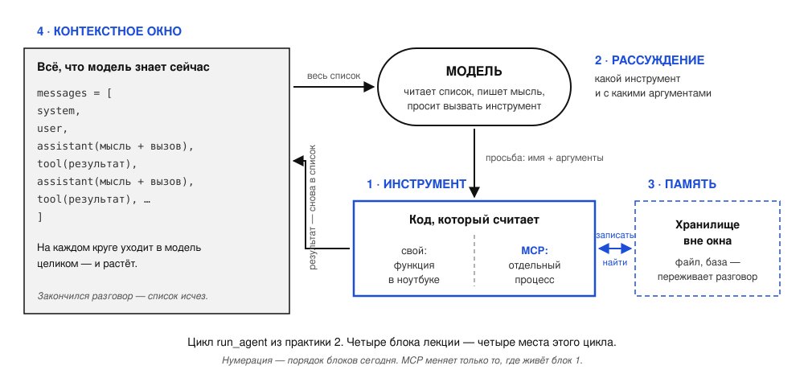
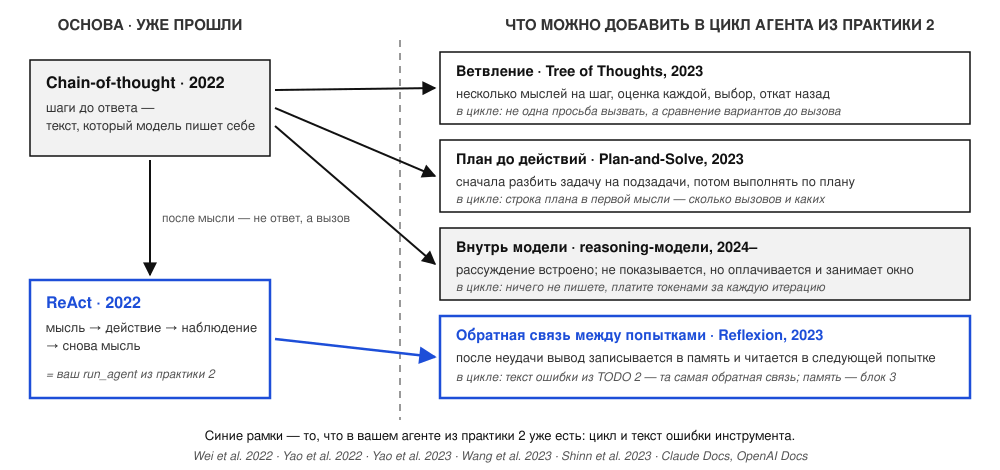
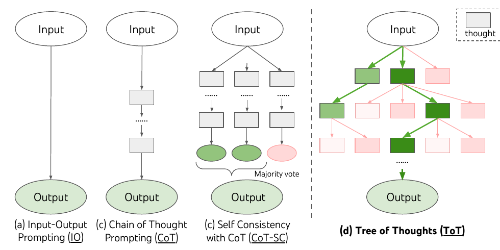
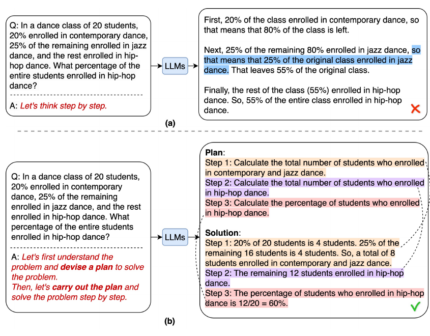
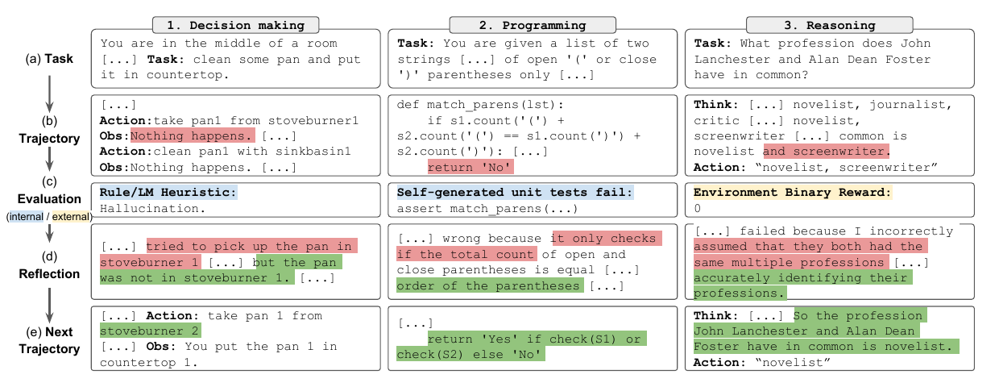
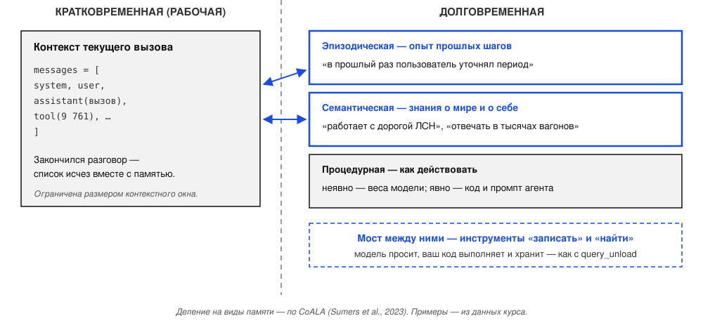
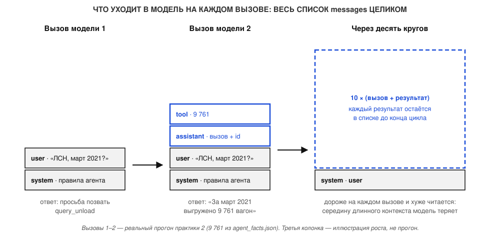
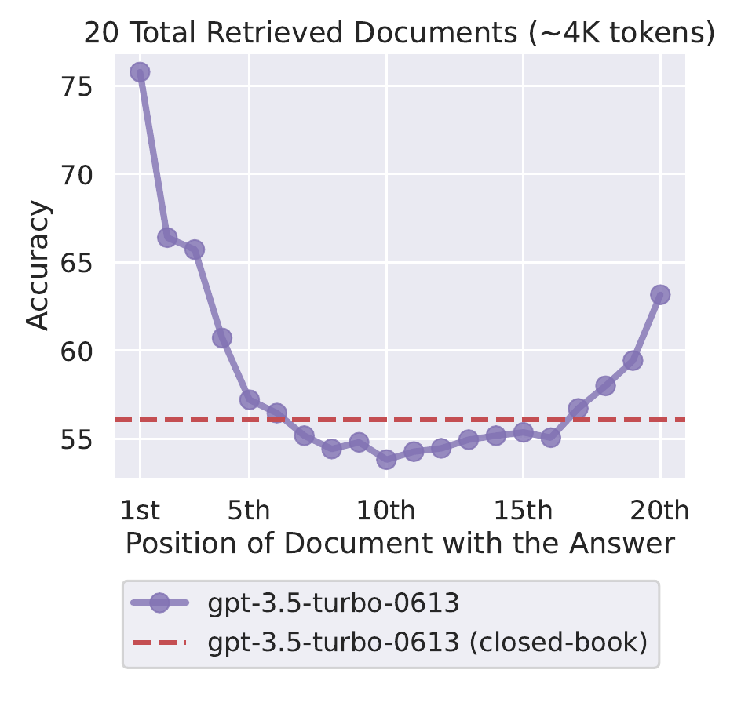

<!-- _class: lead -->

# MCP, рассуждение, память, контекст.  

### Занятие 3 из 8 · 1 октября 2026

**Генеративный искусственный интеллект и ИИ-агенты для транспортной логистики**
РУТ (МИИТ) · 09.04.01 Информатика и вычислительная техника

---

## План вечера

| Часть | Минуты | Что |
|---|---|---|
| 1. Вводная лекция | 30 | четыре элемента одного цикла: инструмент (свой и MCP), рассуждение, память, контекстное окно |
| 2. Практика | 60–90 | три инструмента из практики 2 переезжают на MCP-сервер; рассуждение и контекст — в логе цикла |
| 3. Итоги | 30 | кейсы из жизни и разговор о ваших проектах |

Сегодня занятие одним блоком, **2–2,5 часа**.

---

## Ваш проект  

**Рамок нет.** От агента, который генерирует рекламные шортсы, до ИИ-агента ССП. Логистика и учебные данные — не обязательны. Идеи у команд могут совпадать.

Требование одно: **это агент** — модель сама выбирает инструменты в цикле.

Команда **2–3 человека**. 

---

## Идеи для проекта

| Идея                        | Инструменты                                        | 
|-----------------------------|----------------------------------------------------|
| **Анализ тендеров**         | поиск и загрузка документации, извлечение требований | 
| **Ассистент задач команды** | приём задач, трекер, напоминания                   | 
| **Агент-блогер**            | сбор текстов конкурентов, публикация               | 
| **Агент-исследователь**     | поиск конкурентов по теме, сбор их стилей          | 
| **Агент-контент**           | планирвоание и создание цикла рилсов по теме | 

---

<!-- _class: thesis -->

## Идея лекции и практики

Цикл из практики 2 — это четыре логических блока:
- Модель **рассуждает**, что позвать;
- **Инструмент** считает;
- Всё, что вернулось, ложится в **контекст**;
- То, что должно пережить разговор, уходит в **память**.

Сегодня рассмотрим каждый блок подробнее.

---

<!-- _class: divider -->

# Часть 1. Вводная лекция

### Четыре элемента одного цикла — по одному блоку на каждый

---

## Карта лекции

Схема курса по циклу практики 2; стрелки — те же, что на схеме вызова из лекции 2.

---

<!-- _class: divider -->

# Блок 1 из 4 · Инструмент

### Свой — или MCP. Что меняется, когда инструмент уезжает из вашего процесса

---

## Зачем MCP

Инструменты, которые вы написали на прошлом занятии, **живут внутри ноутбука**. Другое приложение их не позовёт.

**MCP** — открытый стандарт подключения ИИ-приложений к внешним системам. Способ вынести инструменты в **отдельный процесс**, чтобы позвать мог кто угодно.

modelcontextprotocol.io, «What is MCP»: «MCP (Model Context Protocol) is an open-source standard for connecting AI applications to external systems».

---

## Свой инструмент и MCP-инструмент: три разреза

|                                   | Свой (практика 2) | MCP (практика 3) |
|-----------------------------------|---|---|
| **Где работает код**              | обычная функция внутри ноутбука; вызываем её по имени | отдельная программа (сервер); клиент отправляет ей запрос `tools/call` |
| **Откуда приложение знает, какие инструменты есть** | вы сами выписали список `TOOLS` | спрашивает у сервера запросом `tools/list` при запуске — заранее имён в коде клиента нет |
| **Кто пишет то, что видит модель** | вы: описание инструмента, текст ошибки, длину ответа | автор сервера, не вы. Вы пишете только клиент; ошибка приходит с флагом `isError`, а её текст и размер ответа задаёт сервер |

Модель в обоих случаях видит **ровно одно и то же**: имя, описание, схему.

Первые два разреза — таблица лекции 2 и MCP «Architecture overview». Третий — вывод курса, к нему вернёмся в блоке 4.

---

<!-- _class: divider -->

# Блок 2 из 4 · Рассуждение

### Этапы работы LLM до ответа пользователю

---

## Chain-of-thought: шаги до ответа

Модель, которая пишет **промежуточные шаги** до ответа, решает многошаговые задачи лучше: арифметику, задачи на здравый смысл, символьные.

Хватает даже одной фразы: **«давайте подумаем шаг за шагом»**.

Wei et al., Google, 2022: «chain of thought prompting improves performance on a range of arithmetic, commonsense, and symbolic reasoning tasks». Kojima et al., 2022: «LLMs are decent zero-shot reasoners by simply adding "Let's think step by step" before each answer».

---

## Рассуждение в цикле агента

На лекции 2 был **ReAct**: мысль → действие → наблюдение → снова мысль.

«Мысль» между вызовами инструментов — **тот же chain-of-thought**, только теперь после него идёт не ответ, а вызов.

В вашем цикле из практики 2 рассуждение решает одно: **какой инструмент позвать и с какими аргументами**.

Yao et al., ReAct, 2022: «generate both reasoning traces and task-specific actions in an interleaved manner».

---

## Куда развивается рассуждение

Yao et al., ToT, 2023: «considering multiple different reasoning paths and self-evaluating choices». Wang et al., Plan-and-Solve, 2023: «devising a plan to divide the entire task into smaller subtasks».

---

## Ветвление: Tree of Thoughts

Chain-of-thought (c) идёт по **одной** цепочке. ToT (d) **предлагает несколько мыслей, оценивает, выбирает лучшие** и при тупике **откатывается**. Зелёное — выбрано, розовое — отброшено.

«Игра 24»: GPT-4 с chain-of-thought — **4 %**, с ToT — **74 %**.

Yao et al., ToT, 2023, рис. 1: «considering multiple different reasoning paths and self-evaluating choices to decide the next course of action, as well as looking ahead or backtracking when necessary». Цифры — из аннотации статьи. В цикле агента это значит: перед вызовом инструмента модель сравнивает варианты, а не берёт первый.

---

## План до действий: Plan-and-Solve

Одна задача, одна модель, разная фраза. (a) «Подумаем шаг за шагом» → **55 %**, неверно. (b) «Сначала составим план, потом выполним» → **60 %**, верно.

Wang et al., Plan-and-Solve, 2023, рис. 2: «first, devising a plan to divide the entire task into smaller subtasks, and then carrying out the subtasks according to the plan». Целится в ошибку «пропущен шаг». В цикле агента — строка плана в первой мысли.

---

## Self-reflection — и её граница

**Reflexion:** агент разбирает обратную связь по своей попытке, записывает вывод в память и учитывает его в следующей попытке.

**Граница:** без **внешней** обратной связи модель исправляет себя плохо, а иногда ответ после «самопроверки» становится хуже.

Внешняя обратная связь для агента — **результат инструмента**. В том числе текст ошибки, который вы возвращали в TODO 2 практики 2.

Shinn et al., Reflexion, 2023: «verbally reflect on task feedback signals, then maintain their own reflective text in an episodic memory buffer». Huang et al., Google DeepMind, 2023: «LLMs struggle to self-correct their responses without external feedback, and at times, their performance even degrades after self-correction».

---

## Reflexion на примере

Три задачи, одна схема. (b) попытка не удалась → (c) оценка: подсказка среды, упавший тест или «0» → (d) **модель словами записывает, что пошло не так** → (e) следующая попытка с этой записью перед глазами. Красное — ошибка, зелёное — исправление.

Shinn et al., Reflexion, 2023, рис. 1: «verbally reflect on task feedback signals, then maintain their own reflective text in an episodic memory buffer».

---

## Reasoning-модели: рассуждение за деньги

Рассуждение встроено в модель. Пользователю оно целиком не показывается, но **оплачивается как выходные токены** и **занимает место в контексте**.

Правило курса: платить за рассуждение, когда задача **многошаговая**. На «сколько выгрузили в марте» оно не нужно — там нужен инструмент.

Claude Docs, «Thinking: steering and cost»: «Tokens Claude uses while thinking (billed as output tokens)». OpenAI, «Reasoning models»: «they still occupy space in the model's context window and are billed as output tokens». Правило — вывод курса.

---

<!-- _class: punch -->

# Рассуждение помогает выбрать инструмент. **Число считает инструмент.**

Рассуждение повышает шансы на верный ход, но точного числа не гарантирует.

---

<!-- _class: divider -->

# Блок 3 из 4 · Память

### Кратковременная, долговременная — и почему это ещё один инструмент

---

## Память — третье расширение модели

Агентные системы строятся на основе LLM-модель, к которой подключены три расширения. Это поиск по внешним данным, инструменты и память». 

Anthropic, «Building effective agents»: «The basic building block of agentic systems is an LLM enhanced with augmentations such as retrieval, tools, and memory».

---

## Два вида памяти

Sumers, Yao, Narasimhan, Griffiths. CoALA, 2023: «Working memory maintains active and readily available information… for the current decision cycle» · «Episodic memory stores experience from earlier decision cycles» · «Semantic memory stores an agent's knowledge about the world and itself».

---

## Долговременная память — это инструмент

У Anthropic долговременная память оформлена **буквально как инструмент**: модель просит операцию с файлом, а выполняет и хранит данные **ваше приложение**.

Claude Docs, «Memory tool»: «The memory tool operates client-side: Claude requests file operations, and your application executes them». Park et al., Stanford, 2023: «store a complete record of the agent's experiences… synthesize those memories over time into higher-level reflections, and retrieve them dynamically».

---

<!-- _class: divider -->

# Блок 4 из 4 · Контекстное окно

### Ограниченный ресурс, за который платят на каждом вызове

---

## Вся память вашего агента прямо сейчас

Прогон эталона практики 2: 2 итерации, 1 вызов инструмента; 9 761 — notebooks/data/agent_facts.json.

---

## Длинный контекст читается хуже

Контекст — **ограниченный ресурс с убывающей отдачей**: чем длиннее вход, тем хуже модель им пользуется, и деградирует она неравномерно.

Каждый результат инструмента **остаётся в списке** до конца цикла — и уходит в модель заново на каждом вызове.

Отсюда правило лекции 2: инструмент возвращает **ответ, а не все данные**. 

Anthropic, «Effective context engineering for AI agents», 2025: «context… must be treated as a finite resource with diminishing marginal returns». Chroma, «Context Rot», 2025: «model performance degrades as input length increases, often in surprising and non-uniform ways».

---

## Середину контекста модель теряет

Нужный документ находится в начале или в конце контекстного окна— точность выше. **В середине — ниже**, чем без документов вовсе (пунктир).

Liu et al., Stanford, 2023, рис. 1: «performance is often highest when relevant information occurs at the beginning or end of the input context, and significantly degrades… in the middle of long contexts».

---

## Три приёма против роста контекста

| Приём | Что делает |
|---|---|
| **Сжатие (compaction)** | разговор у предела окна сворачивается в сводку, работа продолжается с ней |
| **Заметки вне контекста** | агент сам записывает важное в память вне окна и читает по запросу |
| **Очистка результатов инструментов** | старые результаты убираются из списка — самая безопасная форма сжатия |

Кэширование промпта снижает **цену и задержку**, но размер контекста не меняет.

Anthropic, «Effective context engineering»: «summarizing its contents, and reinitiating a new context window with the summary» · «notes persisted to memory outside of the context window» · «one of the safest lightest touch forms of compaction». Packer et al., MemGPT, 2023. Claude Docs, «Prompt caching». Вывод про размер — курса.

---

## Чужой сервер — чужой объём

Результат MCP-инструмента попадает в `messages` **как есть**. Сколько в нём токенов — решил владелец сервера, а не вы.

Правило «ответ, а не таблица» вы больше **не контролируете**. Контролируете клиент: обрезать длинный результат, чистить старые обращения к инструментам.

Это третий разрез таблицы из блока 1: **описание чужое, ошибка по контракту, объём чужой.** Клиент — последний рубеж перед контекстом.

Anthropic, «Effective context engineering»: очистка результатов инструментов — «one of the safest lightest touch forms of compaction». Вывод про клиент как рубеж — курса.

---

<!-- _class: divider -->

# Часть 2. Практика

### Три инструмента уезжают на MCP-сервер. Цикл этого не замечает

---

## Задание

**Артефакт:** ноутбук `03_mcp_server_client.ipynb` — четыре задания, по одному на элемент агента.

**Сервер** пишется ячейкой `%%writefile server.py` и запускается как **отдельный процесс** (транспорт stdio). Функции над данными — те же, что в практике 2, готовые.

**Цикл агента** — тот же, что вы писали в практике 2; добавлены только ручки для сравнений.

**Критерий:** минимум — `check()` **4/4** (TODO 1–2), полная траектория — **8/8**.

---

## Четыре TODO

| TODO | Что пишете |  
|---|---|
| **1** | `server.py`: `query_load` и `find_wagons` под `@mcp.tool()` по образцу `query_unload`; docstring = описание, аннотации = схема | 
| **2** | `memory_tools.py`: `remember(note)` и `recall()` на том же сервере, файл на его стороне | 
| **3** | `pick_reasoning(question)`: `"none"` или `"low"` — когда модели думать | 
| **4** | `prune_tool_results(messages, keep_last=1)`: старые результаты инструментов → короткая строка | 

---

<!-- _class: divider -->

# Часть 3. Итоги

### Ваши проекты

---

## Ваш проект: тема свободная

**Рамок нет.** От агента, который генерирует рекламные шортсы, до ИИ-агента ССП. Логистика и учебные данные — не обязательны. Идеи у команд могут совпадать.

Требование одно: **это агент** — модель сама выбирает инструменты в цикле.

Команда **2–3 человека**. Заявка — это сегодняшний разговор плюс одно сообщение в issue курса.

---

## Идеи для проекта

| Идея                        | Инструменты                                        |  Память                                        | Контекст                                            |
|-----------------------------|----------------------------------------------------|----------------------------------------------------|-------------------------------|
| **Анализ тендеров**         | поиск и загрузка документации, извлечение требований | | |  
| **Ассистент задач команды** | приём задач, трекер, напоминания                   | | | 
| **Агент-блогер**            | сбор текстов конкурентов, публикация               | | | 
| **Агент-исследователь**     | поиск конкурентов по теме, сбор их стилей          | | | 
| **Агент-контент**           | планирвоание и создание цикла рилсов по теме | | | 

---

## Идеи для проекта

| Идея | Инструменты | Память                                        | Контекст                                            |
|---|---|-----------------------------------------------|-----------------------------------------------------|
| **Анализ тендеров** | поиск и загрузка документации, извлечение требований | что уже просмотрено и отклонено               | документация длинная — разбор по частям             |
| **Ассистент задач команды** | приём задач, трекер, напоминания | кто за что отвечает, сроки                    | история растёт — сводка вместо переписки            |
| **Агент-блогер** | сбор текстов конкурентов, публикация | стиль и прошлые посты                         | тексты конкурентов — выжимка, а не копия            |
| **Агент-исследователь** | поиск конкурентов по теме, сбор их стилей | карта конкурентов, пополняется между сессиями | карта во внешнем хранилище, в контекст — по запросу |
| **Агент-контент**           | планирвоание и создание цикла рилсов по теме | стиль публикации, план проекта       | растет история запросов                             |

---

## Домашнее задание

1. Довести `check()` до **8/8** — на минимальной траектории это TODO 3 и 4 дома.
2. **Механика MCP своими руками:** `my_build_tools` (`tools/list` → формат провайдера) и `my_call_tool` (`tools/call`, `is_error` → текст для модели).
3. **`ToolError` на сервере:** неизвестная станция отдаёт модели причину, а не безликое «Error executing tool».
4. **Четвёртый инструмент `gu12`** — на сервер.
5. **Одно сообщение в issue курса:** состав команды и идея проекта в одну-две фразы.

`check_homework()` проверяет пункты 2 и 3. Следующее занятие — **15 октября**.

MCP Specification 2026-07-28, Tools: «Tool Execution Errors contain actionable feedback that language models can use to self-correct», «reported in tool results with isError: true».

---

## Что почитать к занятию 4

1. [Anthropic. Effective context engineering for AI agents](https://www.anthropic.com/engineering/effective-context-engineering-for-ai-agents) — главное чтение, 20 минут.
2. [Lilian Weng. LLM Powered Autonomous Agents](https://lilianweng.github.io/posts/2023-06-23-agent/) — разделы Planning и Memory.
3. К практике: [What is MCP](https://modelcontextprotocol.io/docs/getting-started/intro) и [спецификация MCP, Server / Tools](https://modelcontextprotocol.io/specification/2026-07-28/server/tools).
4. По интересу: [Chain-of-Thought](https://arxiv.org/abs/2201.11903) · [Reflexion](https://arxiv.org/abs/2303.11366) · [Tree of Thoughts](https://arxiv.org/abs/2305.10601) · [Plan-and-Solve](https://arxiv.org/abs/2305.04091) · [Cannot Self-Correct Yet](https://arxiv.org/abs/2310.01798) · [CoALA](https://arxiv.org/abs/2309.02427) · [MemGPT](https://arxiv.org/abs/2310.08560) · [Lost in the Middle](https://arxiv.org/abs/2307.03172).
5. Для проектов с памятью: [Claude Docs, Memory tool](https://platform.claude.com/docs/en/agents-and-tools/tool-use/memory-tool).

Все ссылки — в slides/lecture-03/SOURCES.md.
